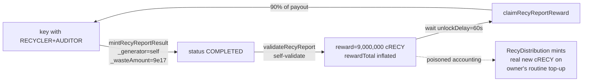

# Security Audit Remediation Plan

**Source report:** Gemini 3.1 Pro, "Security Audit Report: Recy Protocol" (created 2026-08-04, published 2026-08-05).
**This document:** independent verification of that report against `HEAD` of this repo + live Sepolia state, and a prioritised remediation plan.
**Status:** **IMPLEMENTED IN CODE** (see §8). Contract code, tests, scripts, and config have been changed. **Nothing has been deployed and no transaction has been broadcast** — every on-chain step remains for an operator, per `docs/plan/remediation-runbook.md`. Code blocks in §3 are the original specifications; where implementation diverged from them, §8.2 records why.

**Current deployment policy:** abandon existing testnet deployments and deploy the complete
system fresh. Historical live-state observations and phased upgrade instructions below are
retained as investigation context, not instructions for the current build. `RecyToken` is a
standard LayerZero V2 OFT with one designated issuance/rewards chain. Reward epochs now read
`totalIssued`, incremented only by initial issuance and owner minting, never by bridge credits.
Satellite tokens cannot create new issuance and satellite reports cannot initialize. Bridging
and burning therefore cannot roll reward epochs backward. The report forwarder uses the ERC-7201 namespace
`recy.storage.RecyReport.Forwarder`; it no longer occupies an inserted application slot.
The corrected implementation must not be installed on the historical inserted-field proxies.

---

## 0. How to read this document

The source report is an LLM audit and it is **partly unreliable**. It was fed paraphrased/truncated sources — its own file list names `RecyReportShorterCode`, `RecyReportDataShorterCode`, and `Errors`, none of which exist in this repo (`src/` has `RecyErrors.sol`). Consequences we verified:

- It **invented** a `Critical` whose "fix" was already present in its own patch listing.
- It **inverted** a `High` (claimed status 5 reverts; status 5 is handled, status 6 is the gap — and 6 is unreachable).
- It **hallucinated** functions and parameters that do not exist (`setUnlockDelay`, share setters, `setProtocolAddress`, an `admin` parameter on `initialize`).
- Its "production-ready refactor" is **signature-incompatible with the immutable factory** and would brick all future proxy deployments.
- It **missed the single worst bug in the codebase** — a complete treasury drain reachable by a non-admin key that is *already provisioned live*.

Every verdict below is grounded in `file:line` at `HEAD` or in a live `eth_call`. Verification was fanned out across five independent read-only reviewers; disagreements were resolved by reading the source directly.

Severity here is **reachability-adjusted for the actual live deployment** (one proxy, one implementation, real value), not for a hypothetical worst case.

### Live deployment facts that set severity

| Fact | Value | Source |
|---|---|---|
| Proxy (`default`) | `0x91e3E6F9672E985100b8F0798d2cB55fa53c66Da` | `config/contracts.json` |
| Proxy cRECY balance | ~10,009,631 cRECY | live `/proxies` read |
| Reports minted | 64 | live `/proxies` read |
| cRECY `totalSupply` | **30,020,000** → past `LAST_EPOCH` → **FALLBACK** divisor `1e11` | live `eth_call` |
| `unlockDelay` | **60 seconds** | `config/contracts.json` |
| Deployed proxy count | **1**, at `deployedProxies[0]` | `config/contracts.json` |
| `RecyDistribution` | **not deployed**, no deploy script | absent from `config/contracts.json`, `script/deploy/` |

---

## 1. Verdict on the source report's findings

### 1.1 Primary scan

| # | Report claim | Severity claimed | **Verdict** | **Real severity** |
|---|---|---|---|---|
| 1 | State machine bypass & unlimited reward re-validation (`setRecyReportResult`) | Critical | **CONFIRMED (mechanism)** — no status guard, no existence check at `src/RecyReport.sol:305-344`. But the report's *own patch* contains the missing guard, and its `require(ownerOf(x) != address(0))` is dead code under OZ v5 | **High** — see §3.2. Not the primary drain vector (§3.1 is worse and needs no such bug) |
| 2 | Metadata generation DoS (`getStatus` reverts on 5 **and** 6) | High | **PARTIALLY-CONFIRMED / mostly wrong** — status **5 is handled** (`src/RecyReportData.sol:205-206`) and tested (`test/RecyReportData.t.sol:138`). Only status **6 (`FLAGGED`)** reverts, and **nothing in `src/` can ever write 6** | **Informational** (latent) |
| 3 | O(N) gas DoS on factory admin functions | High | **CONFIRMED (shape) / REFUTED (impact)** — loop exists at `src/RecyReportFactory.sol:436-442`, but it `return`s on first match and the live proxy is index 0, so its cost is ~2 SLOADs *forever*. Break-even ≈13,100 proxies ≈6.5B attacker gas | **Low** |
| 4 | Unsafe ERC20 transfers (missing SafeERC20) | Medium | **CONFIRMED (code fact)** — raw `token.transfer` ×4 at `src/RecyReport.sol:424,430,436,441`, returns unchecked | **Low** — cRECY uses OZ ERC20 semantics (reverts on failure). Real only for future non-standard tokens |
| 5 | Arbitrary payout diversion via admin `funds` override | Medium | **CONFIRMED** — `setFundsWallet(address _signatory, address)` is `onlyRole(DEFAULT_ADMIN_ROLE)` at `src/RecyReport.sol:473`, and its own docstring (`:468-472`) claims the opposite ("Accounts can only set their own fund address") | **Medium** |
| 6 | ERC-2771 forwarder forgery | Medium | **REFUTED as an independent vulnerability** — `setTrustedForwarder` (`:501`) and `_authorizeUpgrade` (`:148`) are gated on the *same* role. An admin who could install a malicious forwarder can already replace the entire implementation. Overrides verified correct; feature is not even armed (no forwarder in live config) | **Informational** |
| 7 | Unrestricted public minting of blank NFTs | Low | **CONFIRMED** — `mintRecyReport()` (`:224`) is unguarded | **Low** |
| 8 | Incomplete invalidation protocol | Low | **CONFIRMED** — `invalidateRecyReport` (`:382-400`) computes a reward and sets status 5 but never decrements `rewardTotal`. This is security-relevant, not cosmetic — see §3.5 | **Medium** (upgraded) |
| 9 | Unused `rewardMinted` | Informational | **CONFIRMED** — genuinely declared and unused at `src/RecyReport.sol:55`. The report was **right** about this one | Informational |
| 10 | Duplicate material categories | Informational | **CONFIRMED** — "Glass" at index 2 **and** 5 (`src/RecyReportAttributes.sol:13,16`); reproduced live. Reward math never reads material indices | **Low** + migration hazard |

### 1.2 Secondary "deep-dive" scan

Context: this scan was produced *after* the model refused and was pushed to "look harder" — the highest-risk condition for confabulation. It nonetheless contains one real finding.

| # | Report claim | **Verdict** | **Real severity** |
|---|---|---|---|
| 11 | Metadata lockout via out-of-bounds material index | **CONFIRMED — and materially understated.** See §3.3 | **High** |
| 12 | Unbounded material-array iteration (gas DoS) | **CONFIRMED but self-limiting** — a recycler can only exhaust their own tx gas | **Low** |
| 13 | Economic volatility via `totalSupply` dependence | **FIXED IN CURRENT CODE** — reward epochs use `RecyToken.totalIssued` on the sole issuance/rewards chain. Bridge transfers and burns do not change this counter; `rewardMinted` is not repurposed | **Resolved for fresh deployments** |
| 14 | Empty material array minting | **CONFIRMED** — length checks pass at 0 (`:315-320`); `test_setRecyReportResultWithEmptyArrays` asserts this as *intended* | **Low** |

---

## 2. Hallucination register

Recorded so nobody re-derives these from the report later. **Do not apply the report's code listings.**

| Hallucination | Reality | Why it matters |
|---|---|---|
| `initialize(address admin, …)` — 11 params, grants to both `admin` and `_msgSender()` | Real `initialize` takes **10** params, **no `admin`** (`src/RecyReport.sol:100-111`); all four roles → `_msgSender()` = the factory (`:138-141`) | **Dangerous.** The factory is **immutable and non-upgradeable** and hardcodes `RecyReport.initialize.selector`. Applying the report's refactor changes the selector and **permanently breaks `deployProxy`** for all future proxies |
| `require(ownerOf(_tokenId) != address(0), NftNotExists())` as an existence check | OZ v5 `ownerOf` **reverts** `ERC721NonexistentToken`; it never returns zero. The two existing such checks (`:200`, `:214`) are **unreachable dead code** and `NftNotExists()` can never be raised | Any "add an existence check" patch using this idiom is a no-op. Correct primitive: `_ownerOf(tokenId) != address(0)` |
| `try attributes.getMaterial(...)` **and** try/catch for the status fix | Valid for `getMaterial` (genuine external staticcall). **Invalid for `getStatus`**, which is `internal pure` in the same contract — try/catch requires an external call, so this does not compile | Use a `default` return branch for status, not try/catch |
| `setUnlockDelay`, `setShareRecycler`/etc., `setProtocolAddress` exist and need sum invariants | **None of these setters exist.** The share-sum invariant exists only in `initialize` (`:127-131`) | Findings 6/7 of the SPOF table are about functions that aren't there |
| "`getStatus` reverts for status 5 (Invalidated)" | Status 5 **is** handled (`src/RecyReportData.sol:205-206`) and covered by a passing test | Inverted finding |
| "Factory owner monopolises role management; grant admin to the instance deployer" | Already false live — `grantRole`/`upgradeToAndCall` stay public on the proxy, and **two EOA admins already exist** (`config/contracts.json`), each able to upgrade and to evict the factory | Proposed mitigation is already in place and creates the risk in §3.1 |
| The report's "patched" `RecyReportData.sol` | **Faithfully reproduces the live malformed-JSON bug** (§3.4) that the report never noticed | Its refactor would have shipped a production defect |

---

## 3. Real issues to fix

Ordered by actual risk. **Bold** = missed entirely by the source report.

### 3.1 — CRITICAL — **Complete treasury drain by a single non-admin key**

Not in the source report. This is the finding that matters most.

Four facts compose:

1. `_wasteAmount` is an unbounded `uint128`, attacker-chosen at `src/RecyReport.sol:246-289`.
2. `RecyReward.calculateReward` is **linear and uncapped** in `amount` (`src/lib/RecyReward.sol:23-38`).
3. `validateRecyReport` (`:353-373`) **never requires `_msgSender() != _info.recycler`** — no dual control.
4. There is **no solvency check at validation**; the only guard is a per-token `balanceOf(this) >= ra` at `:416`, which the attacker satisfies by sizing the reward *to* the balance.

Payout legs land on addresses the attacker controls or chooses: generator 20% (attacker picks `_generator` at mint), recycler 60%, validator 10% — **90% to one actor**.



At the live FALLBACK divisor (`1e11`), reward = `wasteAmount_mg × 1e7` wei. A single report with `wasteAmount = 9e17` mg yields a **9,000,000 cRECY** claim — comfortably below the `uint128` overflow bound (`3.403e20`), so **one** report suffices. Three transactions, ~60 seconds apart.

**Reachable without the admin key — verified on-chain, not just in config.** Live `hasRole` reads against the proxy (2026-08-10):

| Principal | `RECYCLER` | `AUDITOR` | `DEFAULT_ADMIN` |
|---|---|---|---|
| `0x5f3CD35206c0526b837766d48D022522a9910b64` | ✅ | ✅ | ❌ |
| `0x3402ce3b5f88c852c0d6992C69A03095d1345BBd` | ✅ | ✅ | ✅ |
| `0xF62DaAe4c3f9Fadf689F767716a82dFEe5026C89` | ✅ | ✅ | ✅ |
| `0x957C90a7…0B51` (the factory) | ✅ | ✅ | ✅ |

**Four** principals hold the `RECYCLER`+`AUDITOR` pair, and `0x5f3CD352…` holds it with **no** admin role — a genuine non-admin drain key. On-chain state is **broader than `config/contracts.json`**, which lists `0xF62DaAe4…` only under `admins`/`emergency`; it in fact also holds both operational roles. Live `unlockDelay` = **60**; live shares = **60/10/20/10**, so recycler + validator + generator = **90%** to a single self-dealing actor. `0x3402ce3b…` is additionally `addresses.protocol`, capturing the remaining 10%.

Second-order amplification: `RecyDistribution.calculateTokensToMint` (`src/RecyDistribution.sol:102-118`) computes `shouldHave = rewardTotal - rewardClaimed` and `mintTokensToReport` (`:126-140`) **mints real cRECY** to close the gap. The attacker cannot call it (`onlyOwner`), but a poisoned `rewardTotal` means the operator's *routine* top-up mints attacker-claimable supply. `rewardTotal` integrity is therefore a **security invariant**, not bookkeeping. (`RecyDistribution` is not yet deployed — fix before it ships.)

**Remediation, in order of speed:**

- **P0-a (operational, no code, deployable today).** Split the roles. No address should hold both `RECYCLER_ROLE` and `AUDITOR_ROLE`. Revoke one side from **all four** principals above via `factory.revokeAuditorRole` / `revokeRecyclerRole` (`src/RecyReportFactory.sol:249,281`) — including the factory's own inert grants (least privilege). **This alone removes the unassisted drain path** and requires no deployment. Update `script/ManageRoles.s.sol` + `config/contracts.json` so the overlap is not silently re-applied, and note that config currently *understates* the live grants.
- **P0-b (code, next upgrade).** Enforce dual control in `validateRecyReport`: `require(_msgSender() != _info.recycler, ...)`. Add a solvency check at validation so the protocol cannot promise what it cannot pay. Add a sane upper bound on `_wasteAmount` at both write paths (a per-report cap sized to real-world physical plausibility — 1e15 mg = 1,000 t is already generous; pick the number with the product owner and add a named error).
- **P0-c.** Raise `unlockDelay` from 60s to a value that gives a human monitor time to react. Requires an upgrade (no setter exists) — bundle with P0-b, and add `setUnlockDelay(uint64) onlyRole(DEFAULT_ADMIN_ROLE)` while there.

### 3.2 — HIGH — Missing status guard on `setRecyReportResult`

`src/RecyReport.sol:305-344` checks only array-length parity. No status guard, no existence check. A `RECYCLER_ROLE` key can reset any token — including `REWARDED` ones owned by third parties — back to `COMPLETED`, after which `validateRecyReport` accepts it again, re-inflating `rewardTotal` and enabling a second claim. Materials **append**, they do not replace.

It also succeeds on **nonexistent** tokenIds (writing `status = 2` and materials for an unminted id), which corrupts `rewardTotal` even though the eventual `claim` would revert in the `ownerOf` modifier.

> **This is currently encoded as intended behaviour.** `test/RecyReport.t.sol:559-587` (`test_setRecyReportResultTwice`) explicitly asserts that a second call succeeds, and `:532-557` (`test_setRecyReportResultOnNonExistentToken`) asserts success on an unminted id. Fixing this is a **deliberate behaviour change** requiring product sign-off, not a typo repair.

**Remediation.** Gate on `status[_tokenId] == RecyConstants.RECYCLE_CREATED`, and add a real existence check using `_ownerOf(_tokenId) != address(0)` (**not** `ownerOf(...) != address(0)`). Decide explicitly whether correcting a mistyped report is a required operator workflow; if it is, add a separate, `AUDITOR`-gated amend path that clears `materials[_tokenId]` and cannot re-open a `REWARDED` report. Update/replace the two tests above.

### 3.3 — HIGH — Unvalidated material index permanently bricks NFT metadata

Neither write path validates material ids against the catalogue; `material` is `uint32` against a 13-entry array. `RecyReportData.sol:140` then calls `attributes.getMaterial(id)`, which reverts (`src/RecyReportAttributes.sol:63-69`) — so **both `tokenURI` and `tokenJson` revert forever** for that token.

**Unrecoverable in place.** `materials[tokenId]` is push-only (`src/RecyReport.sol:274,329`) — no `delete`, no `pop`, no setter, no admin repair anywhere. Re-calling `setRecyReportResult` appends, so the poison entry survives every subsequent write. `addMaterial` can only rescue small out-of-range indices; an index near 2^32 is unrescuable that way.

Amplified by §3.2: with no status or existence guard, one `RECYCLER` key can brick **every** existing token in a loop, and even **pre-poison not-yet-minted ids** (later `mintRecyReport` overwrites `status` but never `materials`, so the token is born bricked).

**No attacker required.** An honest client posting an id from a newer catalogue than the attributes contract behind that proxy produces the same permanent brick. `test_setRecyReportResultWithMaxValues` (`test/RecyReport.t.sol:503-530`) already proves the write path accepts `type(uint32).max` — it just never reads the metadata back.

**Remediation (defence in depth — do both).**
1. **Write-time validation** in both write paths: reject ids `>= attributes.getMaterialsCount()` (and the same for any other index that reaches a bounded getter). Prevents new bricks.
2. **Read-time tolerance** in `RecyReportData.generateMaterialsText`: `try attributes.getMaterial(id) … catch { "Unknown Material" }`. This is the **only** way to un-brick the tokens that may already be poisoned, since it ships via a new `RecyReportData` + `setDataContract` (`src/RecyReport.sol:477`) and needs no proxy upgrade.

Audit the 64 live reports for out-of-range indices before deciding urgency.

### 3.4 — MEDIUM — **`tokenURI` emits malformed JSON on every live token**

Missed by the source report, and silently preserved in its "patched" listing.

`generateStatusText` (`src/RecyReportData.sol:194-196`) already returns a complete trait object, but `tokenUriAttributes` wraps it **again** inside a string value (`:73-75`):

```
'","attributes": [{"trait_type":"Status","value":"',   // opens a value string
generateStatusText(_status),                           // → {"trait_type":"Status","value":"Rewarded"}
'"}',
```

Verified live against `tokenURI(1)` on `0x91e3…66Da`:

```json
"attributes": [{"trait_type":"Status","value":"{"trait_type":"Status","value":"Rewarded"}"},…
```

Unescaped quotes — **invalid JSON**. Every marketplace, indexer, and wallet parsing `tokenURI` fails on all 64 tokens. `tokenJson` (`:111`) is correct; only `tokenURI` is affected, which is why it went unnoticed in the app.

**Remediation.** Drop the outer wrapper at `:73-75` so `generateStatusText` is emitted directly, exactly as `tokenJson` does. Ships via new `RecyReportData` + `setDataContract` — **no proxy upgrade needed**. Cheapest high-visibility win in this plan; do it first.

### 3.5 — MEDIUM — `rewardTotal` is never decremented; double-counts on re-validation

`validateRecyReport` does `rewardTotal += _reward.rewardAmount` (`src/RecyReport.sol:368`). `invalidateRecyReport` (`:382-400`) sets status 5 but **never decrements**, despite the constant's own doc promising "remaining rewards returned to the pool" (`src/lib/RecyConstants.sol:41`). Combined with §3.2, re-validation adds the same reward repeatedly.

Because `RecyDistribution` mints against `rewardTotal - rewardClaimed` (§3.1), this is a **supply-integrity** bug, not cosmetic.

**Remediation.** Decrement `rewardTotal` on invalidation. Define and document the invariant (`rewardTotal - rewardClaimed == outstanding claimable obligations`) and assert it in tests. Either wire `rewardMinted` to something real or delete it (`:55`) — do not leave a variable whose name implies an invariant it does not hold.

### 3.6 — MEDIUM — Admin-controlled payout redirection (`setFundsWallet`)

`setFundsWallet(address _signatory, address _fundAddress)` is `onlyRole(DEFAULT_ADMIN_ROLE)` (`:473`) while its docstring claims self-service. `funds[]` is read at **claim** time (`:424,429,435`) but the reward amount is snapshotted at **validation** (`:366-367`) — so an admin can redirect 90% of an already-validated, already-earned payout right before the owner claims. Reachable by the factory owner too, via `setRecyclerFund`/`setAuditorFund` (`src/RecyReportFactory.sol:453,467`), neither of which checks the target holds the role.

**Remediation.** Make it self-service (`funds[_msgSender()] = _fundAddress`), matching the docstring, and drop or role-check the factory passthroughs. If admin-set wallets are an operational requirement, snapshot the payout destinations at validation instead of resolving them at claim.

> Note: `test_setFundsWallet` and the fund-wallet claim tests (`test/RecyReport.t.sol:1231-1454`) currently exercise the admin-sets-for-others signature and will need rewriting. Those tests also assert payouts using the *same* percentage formula the contract uses, so they cannot catch a formula error — replace with independent expected constants.

### 3.7 — MEDIUM — Factory owner is an unmitigated SPOF

`RecyReportFactory` is plain `Ownable` (`:14,65`) — not `Ownable2Step`, renounceable, no timelock. The owner can upgrade any proxy to arbitrary logic (`:418-426`; OZ v5's only bar is `proxiableUUID`, trivially met), grant/revoke every role, and redirect payouts. `_authorizeUpgrade` is `onlyRole(DEFAULT_ADMIN_ROLE)` with no delay (`src/RecyReport.sol:148`).

Distinct principals that can replace the live implementation **today**: the factory (via its owner EOA), `0x3402ce3b…5BBd`, `0xF62DaAe4…6C89`, plus anyone they subsequently grant.

Two related footguns:
- `revokeAdminRole(proxy, factory)` (`:313`) and `renounceOwnership()` are single unguarded calls that **irreversibly** sever factory control.
- **A replacement factory can never adopt the existing proxy** — all 16 privileged paths gate on `_isDeployedProxy` and there is no `registerProxy`. Any v2 factory **must** ship `registerExistingProxy(address,string)`.

**Remediation (operational first).** Transfer factory ownership to a multisig; add a timelock for upgrades. Split the `0x3402ce3b…` superkey. Both are config/ops changes needing no new contract.

### 3.8 — LOW / INFORMATIONAL

| Issue | Location | Action |
|---|---|---|
| Raw `token.transfer` ×4, unchecked | `src/RecyReport.sol:424-441` | Adopt `SafeERC20`. Note `token` is declared concrete `ERC20` (`:121`) — use `SafeERC20.safeTransfer(IERC20(address(token)), …)` or change the declaration to `IERC20` (same slot, ABI stays `address`). Breaks no existing test |
| `getStatus` reverts for status 6 / status 0 | `src/RecyReportData.sol:198-212` | Add a default `return "Unknown"` branch. **Not** try/catch (internal pure). Do this when touching §3.4 |
| `RECYCLE_FLAGGED` unreachable; `FLAGGED` branches in validate/invalidate are dead | `src/lib/RecyConstants.sol:45`; `src/RecyReport.sol:355,384` | Either implement `flagReport()` or delete the dead branches. The old test fabricated this state by writing a hard-coded storage slot; that implementation-dependent test was removed |
| Permissionless `deployProxy` → permanent name squatting; deploy script silently "reuses" a squatted proxy | `src/RecyReportFactory.sol:96`; `script/deploy/RecyReportProxyDeploy.s.sol:47-53` | Gate `deployProxy` in v2; make the script fail loudly on an unexpected pre-existing proxy |
| `_isDeployedProxy` O(N) | `src/RecyReportFactory.sol:436-442` | `mapping(address => bool)` in v2. **Low priority** — not reachable against the live proxy |
| `protocolAddress` unvalidated, no setter → a zero value bricks every claim | `src/RecyReportFactory.sol:90`; `src/RecyReport.sol:441` | Zero-check in v2; add `setProtocolAddress` (append-only, layout-safe). Live value is non-zero |
| Degenerate epoch: `FOURTH`/`FIFTH` are **1 token** apart with a 100× reward cliff | `src/lib/RecyReward.sol:11-12,18-19` | Product decision. Likely a typo; confirm intent before changing (changes payout rates) |
| Reward rate depended on burnable/bridgeable `totalSupply` | `src/RecyReport.sol`; `src/RecyToken.sol` | **Implemented:** cumulative `totalIssued` records initial supply and owner minting only. Source-chain issuance and report-initialization checks avoid unsynchronized reward accounting on satellite chains |
| `uint128` overflow in `calculateReward` above ~3.4e20 mg bricks validate **and** invalidate for that report | `src/lib/RecyReward.sol:25` | Subsumed by the §3.1 `_wasteAmount` cap |
| Duplicate "Glass" (idx 2 and 5); `materialSvg` has 11 entries vs 13 materials | `src/RecyReportAttributes.sol:13,16` | **DO NOT RENUMBER** — 64 live reports store raw indices; removing idx 5 silently relabels every stored index ≥6. Rename in place via a new attributes+data deployment, or stop emitting idx 5 client-side. Also: live idx 12 reads "Solid Inert Industrial Waste" vs HEAD's "Inert Industrial Waste" — **deployed bytecode ≠ HEAD**, verify on-chain before any migration |
| Empty-material reports allowed | `src/RecyReport.sol:315-320` | `require(length > 0)`. Breaks `test_setRecyReportResultWithEmptyArrays` (`test/RecyReport.t.sol:459-478`) — product decision |
| Unguarded `mintRecyReport()` spam | `src/RecyReport.sol:224` | Gate or rate-limit if state bloat matters |
| Dead `require(ownerOf(x) != address(0))`; unused `NftNotExists`, `RewardAlreadyClaimed`, `RecyclerAlreadyHasProxy`, `InvalidRecyclerAddress` | `:200,214`; `src/RecyReportFactory.sol:52-53` | Delete or implement |
| `recycleType`/`recycleShape`/`disposalMethod` are stored but **never rendered** in metadata | `src/RecyReportData.sol` | Silent data loss — wire them in or stop collecting them |
| `string indexed proxyName` → names unrecoverable from logs | `src/RecyReportFactory.sol:33` | Un-index in v2 |
| `ManageRoles.s.sol` passes a page index where a byte offset is expected | `script/ManageRoles.s.sol:183` vs `:156` | Off-chain bug; fix when touching that script |

---

## 4. Execution plan

### Phase 0 — Operational, no deployment (do immediately)

Removes the Critical without shipping a line of Solidity.

1. Revoke the `RECYCLER`+`AUDITOR` overlap from all four principals in §3.1 (`0x5f3CD352…`, `0x3402ce3b…`, `0xF62DaAe4…`, and the factory).
2. Update `config/contracts.json` and `script/ManageRoles.s.sol` so the overlap is not re-applied.
3. Begin factory-ownership transfer to a multisig.
4. Audit the 64 live reports for out-of-range material indices (§3.3) to size that work.

### Phase 1 — `RecyReportData` redeploy + `setDataContract` (no proxy upgrade)

Cheapest real fixes; independent of the risky upgrade path.

1. Fix the malformed `tokenURI` JSON (§3.4).
2. Add the `getStatus` default branch (§3.8).
3. Add read-time `try/catch` tolerance for out-of-range material ids (§3.3, part 2).
4. Zero-check `_svgAddress` in the constructor.

Then `setDataContract` on the live proxy and re-verify `tokenURI(1)` decodes as valid JSON.

### Phase 2 — `RecyReport` implementation upgrade (UUPS)

Bundle, because each upgrade carries risk:

1. Dual control in `validateRecyReport` (§3.1).
2. Validation-time solvency check + `_wasteAmount` cap (§3.1).
3. Status guard + `_ownerOf` existence check on `setRecyReportResult` (§3.2).
4. Write-time material-id validation (§3.3, part 1).
5. `rewardTotal` decrement on invalidation (§3.5).
6. Self-service `setFundsWallet` (§3.6).
7. `SafeERC20` (§3.8).
8. Add `setUnlockDelay`, `setProtocolAddress` (§3.1, §3.8).
9. Delete or implement `rewardMinted` and the dead code (§3.5, §3.8).

**Hard constraints for the implementer:**

- **Do not change the `initialize` signature.** The immutable factory hardcodes its selector; changing it breaks all future `deployProxy` calls.
- **`RecyReport` reserves no `__gap`.** Future state must be appended after `funds` or isolated in an ERC-7201 namespace. The corrected layout has `protocolAddress` at slot 2 and `funds` at slot 11; the forwarder is namespaced. Do not upgrade historical inserted-field proxies to this build.
- Adding functions, modifiers, events, and errors is layout-safe.
- Run the OZ upgrade-safety validator against the deployed implementation before upgrading.

### Phase 3 — Factory v2 (new deployment; factory is not upgradeable)

1. `mapping(address => bool) isDeployedProxy` (O(1)).
2. Gate `deployProxy`.
3. **`registerExistingProxy(address,string)`** — mandatory, or v2 can never manage `0x91e3…66Da`.
4. `Ownable2Step` + timelock; guard against self-revocation of the factory's own admin role.
5. Zero-check `protocolAddress`; un-index `proxyName`; name-length cap.

### Phase 4 — Pre-deployment fixes for `RecyDistribution`

Not deployed; fix before it ships. Its mint path trusts `rewardTotal` (§3.1, §3.5), and `calculateTokensToMint` carries the same O(N) scan (`src/RecyDistribution.sol:90-95`).

### Phase 5 — Product decisions (not security fixes)

Epoch cliff (§3.8), duplicate-material migration (§3.8), whether report amendment is a required workflow (§3.2), whether empty reports are legal (§3.8). The emissions-basis decision is now resolved: cumulative issuance on one chain, with standard OFT bridging to satellites.

---

## 5. Test impact

Ground truth from the existing suite. These tests **encode current behaviour** and must be updated as part of the corresponding fix:

| Fix | Tests that break | Location |
|---|---|---|
| Status guard on `setRecyReportResult` | `test_setRecyReportResultTwice`, `test_setRecyReportResultOnNonExistentToken` (the latter because unminted tokens default to status **0**, not `CREATED`, so a bare `CREATED` guard rejects it too) | `test/RecyReport.t.sol:559-587`, `:532-557` |
| `require(materials.length > 0)` | `test_setRecyReportResultWithEmptyArrays` | `test/RecyReport.t.sol:459-478` |
| Self-service `setFundsWallet` | `test_setFundsWallet` + the fund-wallet claim tests | `test/RecyReport.t.sol:1231-1454` |
| Material-id range check | none break, but `test_setRecyReportResultWithMaxValues` documents the hole | `test/RecyReport.t.sol:503-530` |
| `SafeERC20` | none — cRECY has standard semantics and the balance pre-check at `:416` fires first | — |

**New tests required** (each must fail against current `HEAD`):

1. The §3.1 drain, end to end, as a single non-admin key holding `RECYCLER`+`AUDITOR` → must revert after the fix.
2. `tokenURI` output parses as valid JSON (§3.4) — assert on decoded bytes, not a substring.
3. `tokenURI`/`tokenJson` survive an out-of-range material id (§3.3).
4. Re-validation after `setRecyReportResult` cannot inflate `rewardTotal` (§3.2, §3.5).
5. Invariant: `rewardTotal - rewardClaimed` equals outstanding obligations across mint → validate → invalidate → claim (§3.5).
6. Payout assertions using **independent** expected constants, not the contract's own formula.

---

## 5a. Fixes do not propagate to new proxies — Phase 3 is load-bearing

**The factory bakes both the implementation and the data contract in permanently.**

```solidity
address public immutable implementation;   // src/RecyReportFactory.sol:15
address public immutable dataContract;     // src/RecyReportFactory.sol:18
```

`deployProxy` wires both into every new proxy — `dataContract` into the initializer payload (`:107`) and `implementation` into the proxy itself (`:117`):

```solidity
bytes memory initializeCall = abi.encodeWithSelector(
    RecyReport.initialize.selector, name, symbol, tokenAddress,
    dataContract,            // :107  ← old, buggy RecyReportData
    …);
ERC1967Proxy newProxy = new ERC1967Proxy(implementation, initializeCall);  // :117  ← old, vulnerable impl
```

**Consequence.** Phase 1 repairs the live proxy's metadata by pointing it at a new `RecyReportData` via `setDataContract`, and Phase 2 upgrades the live proxy's implementation. Neither touches the factory's immutables. Any proxy deployed afterwards through the existing factory is **born with the old buggy `RecyReportData` (malformed `tokenURI`, no material tolerance) and the old vulnerable implementation (no status guard, no dual control, unbounded `_wasteAmount`)** — every Phase 1/2 fix silently absent. `deployProxy` is permissionless (`:96`), so this needs no privileged mistake to happen.

This reframes **Phase 3 from cleanup to a correctness requirement**: until a v2 factory exists, "the vulnerability is fixed" is true only of proxy `0x91e3…66Da`.

**Scoping the risk honestly.** An *attacker*-deployed proxy is largely inert: `initialize` grants all four roles to the factory (`src/RecyReport.sol:138-141`), and the factory exposes no passthrough to `mintRecyReport`/`validateRecyReport`, so a stranger's proxy cannot mint or validate and therefore cannot run §3.1. The real exposure is a **legitimate future deployment** — a second recycling plant — silently inheriting pre-fix code, with nothing in the deploy path to warn the operator.

**Interim mitigations until Phase 3 ships:**

1. Treat the existing factory as **deprecated for new deployments**. Deploy no new plants through it after Phase 1.
2. If a new plant is unavoidable before Phase 3: immediately post-deploy, call `setDataContract(<new data>)` on the new proxy and `factory.upgradeProxy(<new proxy>, <new impl>)`, then verify `tokenURI` parses and the status guard reverts as expected. Add this to the deploy runbook as a required step, not a note.
3. Make `script/deploy/RecyReportProxyDeploy.s.sol` assert that the factory's `implementation` and `dataContract` equal the current blessed addresses, and **abort** otherwise. This is the cheap guardrail that turns a silent regression into a failed script.
4. Phase 3's v2 factory should read `implementation`/`dataContract` from owner-settable storage (with events) rather than `immutable`, so future fixes propagate without another factory migration — while keeping `registerExistingProxy` so it can adopt `0x91e3…66Da`.

---

## 5b. Downstream coupling: `recy-api`

The backend at `../recy-api` is coupled to two of the defects being fixed. Both need coordinated changes; neither is optional.

### 5b.1 The cache invariant is built *around* the missing status guard

`src/services/chain-reader.ts:128-136` encodes the current bug as a documented carve-out:

```ts
/**
 * Status codes covered by THE FENCING INVARIANT (RecyReport.sol): while a
 * token holds one of these statuses, no report field … can change without the
 * status changing too. Status 2 (COMPLETED) is mutable in place
 * (setRecyReportResult has no status guard) and is never fence-cacheable.
 */
export const FENCEABLE_STATUSES: ReadonlySet<number> = new Set([1, 3, 4, 5]);
```

This is **correct today** and must not be "tidied up" before §3.2 lands — status 2 genuinely is mutable in place, so caching it would serve stale data.

After §3.2, `COMPLETED` becomes terminal-until-validated and status 2 becomes fence-cacheable. That is a **performance opportunity, not a break**: add `2` to `FENCEABLE_STATUSES` and update the comment to cite the new guard. Sequence it *after* the upgrade is live on-chain, never before — and note the fence must key on the implementation version, since a pre-fix proxy (see §5a) still has mutable status 2. **A global constant is unsafe once two implementation versions coexist**; scope it per-proxy or gate it on a version read.

### 5b.2 `POST /set-result` starts reverting for non-`CREATED` tokens

The endpoint is live: route at `src/routes/recy-report.ts:189-190`, handler at `:1027-1045`, calldata via `encodeSetRecyReportResultCalldata` (`src/services/recy-report-contract.ts:50-53`). Today it succeeds against a token in **any** status. After §3.2 it reverts unless the token is `CREATED`.

**Good news — the error surface already exists.** The revert-selector map at `src/routes/recy-report.ts:534-583` already carries both errors the fix should raise (selectors computed and matched):

| Error | Selector | Mapped to | Line |
|---|---|---|---|
| `RecyReportInvalidStatus()` | `0x973bae08` | `REPORT_INVALID_STATUS` → **409** | `:579-583` |
| `NftNotExists()` | `0xc9fa7232` | `NFT_NOT_EXISTS` → **400** | `:545-549` |

**Implementer constraint (important).** The Phase-2 guard **must reuse `RecyErrors.RecyReportInvalidStatus()`** for the status check and **`RecyErrors.NftNotExists()`** for the `_ownerOf` existence check. Do **not** introduce new custom errors for these: the existing selectors are already mapped to correct, well-typed HTTP responses, so reusing them means **zero backend change** for error handling. A new error would fall through to the generic `EXECUTION_FAILED` (`:527-532`, a 409 with a vague message) and degrade the API.

Pleasing side effect: `NftNotExists()` is currently **unraisable dead code** (OZ v5 `ownerOf` reverts first, §2), so its mapping has never fired. A real `_ownerOf`-based existence check finally makes that mapping work as originally intended.

**Required `recy-api` work, sequenced:**

1. **Before** the upgrade: audit callers of `POST /set-result`. If any client relies on re-populating an already-`COMPLETED` report, that workflow breaks — this is the concrete consumer of the §3.2 product decision, so resolve it here.
2. **Before** the upgrade: if amend-after-complete is a real workflow, the API needs a distinct endpoint mapped to whatever amend path Phase 2 provides.
3. **With** the upgrade: extend the write-path integration tests to assert a 409 `REPORT_INVALID_STATUS` on a non-`CREATED` token.
4. **After** the upgrade: add status `2` to `FENCEABLE_STATUSES`, version-scoped per §5b.1.
5. Unrelated but adjacent: fix `script/ManageRoles.s.sol:183` (page index passed where a byte offset is expected, §3.8) while touching role provisioning for Phase 0.
6. **With** the upgrade: add revert-selector mappings for the errors newly reachable from client paths — `WasteAmountExceedsCap()` `0xe21e2bba`, `ValidatorCannotBeRecycler()` `0x3fdc78d6`, `MaterialIdOutOfRange()` `0x31889f1c`, `EmptyMaterialsArray()` `0x078c300a`, and (admin tooling only) `UnlockDelayOutOfBounds()` `0x82838267` — so they surface as typed 4xx responses instead of falling through to the generic `EXECUTION_FAILED` 409 (`:527-532`). The two errors the §5b.2 constraint pinned (`RecyReportInvalidStatus`, `NftNotExists`) need no backend change, as designed.

---

## 6. Explicitly rejected from the source report

- **Do not apply any of its three code listings.** The `RecyReport.sol` listing changes the initializer signature (breaks the immutable factory); the `RecyReportData.sol` listing preserves the live malformed-JSON bug; the `RecyReportFactory.sol` listing omits `registerExistingProxy`, so it would orphan the live proxy.
- **Do not treat the ERC-2771 forwarder as a distinct vulnerability.** Same role as upgrade authority; fixing it changes nothing while `_authorizeUpgrade` is a single un-timelocked role.
- **Do not prioritise the factory O(N) loop.** ~13,100 proxies / ~6.5B gas to matter, and the live proxy sits at index 0 where cost never grows.
- **Do not "fix" `getStatus` for status 5.** It is already correct.
- **Do not renumber material indices.** 64 live reports store raw indices.

---

## 7. Provenance

- Report text extracted from the shared Gemini transcript; file listing shows paraphrased sources (`*ShorterCode`), confirming the audit did not see this repo's actual code.
- Verification: five independent read-only reviewers (factory / reward economics / metadata / access control / test coverage), plus direct source reads and live `eth_call`s by the lead. Cross-agent disagreements resolved against source.
- Live reads performed against Sepolia via `https://ethereum-sepolia-rpc.publicnode.com`.
- Gas figures in §3.1/§3.8 are analytic (EIP-2929/2200 cost model), not measured — order-of-magnitude only. They do not affect any verdict.
- Live role grants, `unlockDelay`, and shares were **verified on-chain** via `hasRole`/getter `eth_call`s against `0x91e3…66Da` (see §3.1) — they are not merely config-derived, and on-chain is broader than config.
- Not verified: the **deployed bytecode** of implementation `0xc2b9a91f…e6B1` was not disassembled. The attributes drift noted in §3.8 proves deployed code ≠ `HEAD`, so re-confirm any *function-level* assumption against the live implementation before Phase 2.

---

## 8. Implementation record

### 8.1 What shipped

| Phase | Deliverable | Evidence |
|---|---|---|
| 1 | `src/RecyReportData.sol` — JSON fix, `getStatus` default + `Flagged`, try/catch material tolerance, `_svgAddress` zero-check, `materialsCount()`; `src/RecyReportAttributes.sol` — `materialSvg` 11→13 with authentic live values, `material[12]` corrected, `getMaterialsCount()` added | `test/RecyReportData.t.sol` 27/27, `test/RecyReportAttributes.t.sol` 52/52 |
| 2 | `src/RecyReport.sol` — dual control `:412`, solvency `:429`, waste cap `:277`, status guard `:366` + existence `:365`, material-id bounds `:280-282`, empty-array reject `:276`, self-service `setFundsWallet` `:549`, SafeERC20 `:490-510`, `setUnlockDelay` `:566`, `setProtocolAddress` `:579`, `_requireOwned` `:219,:233` | `test/RecyReport.t.sol` 118/118 |
| 3 | `src/RecyReportFactoryV2.sol` (608 ln) — O(1) `isDeployedProxy`, **`registerExistingProxy`**, gated `deployProxy`, mutable impl/data with events, `Ownable2Step` + `renounceOwnership` disabled, self-revocation guard, `protocolAddress` zero-check, un-indexed `proxyName`, 64-byte name cap, `getProxyNamesPaginated` | `test/RecyReportFactoryV2.t.sol` 49/49 |
| 4 | `src/RecyDistribution.sol` — per-call + cumulative mint caps, typed mint blockers, O(1) membership, non-aborting batch, target sanity checks | `test/RecyDistribution.t.sol` 73/73 |
| 0 | `config/contracts.json` role split + `unlockDelay` 60→86400; `script/ManageRoles.s.sol` separation guard + pagination fix; `RecyReportProxyDeploy.s.sol` blessed-address guardrail; new redeploy/upgrade scripts; `docs/plan/remediation-runbook.md` | `jq` overlap query returns `[]` |

**Suite: 455 passed / 0 failed** (baseline at HEAD was 336 passed / **11 failed**). Full `forge build` clean.

`initialize` retains its 10-parameter selector, `0x54de02e5`. The subsequent forwarder repair restores 12 application slots, with `protocolAddress` at 2, `rewardMinted` at 5 and `funds` at 11, plus ERC-7201 forwarder storage. The former 13-slot implementation is incompatible; use fresh deployments, not an in-place upgrade of the historical testnet proxies.

### 8.2 Where the plan was wrong, and what was done instead

Five defects in this document were found during implementation. Each would have shipped a bug if followed literally.

1. **§3.5 "decrement `rewardTotal` on invalidation" would underflow and revert unconditionally.** `invalidateRecyReport` accepts only `COMPLETED`(2)/`FLAGGED`(6), but `rewardTotal` is incremented *only* on the transition to `VALIDATED`(3) (`src/RecyReport.sol:418`). At invalidation nothing was ever added. **Instead:** the real double-count is closed by the §3.2 status guard; invalidation now writes `rewardAmount = 0` / `rewardUnlockDate = 0` rather than a reward that could never be claimed but which `RecyReportData` rendered for any status > 2; the copy-pasted docstring was corrected; the invariant is documented on the declarations.
2. **The solvency check must be outstanding-only.** `rewardTotal + new <= balanceOf(this)` double-counts already-claimed rewards, because `rewardTotal` is never decremented while the balance *drops* as claims settle — a validation DoS that only appears in production after enough claims. Shipped form (`:429`): `rewardTotal <= balanceOf(this) + rewardClaimed`, algebraically `rewardTotal - rewardClaimed <= balance`, with the subtraction on the RHS so it cannot underflow. Matches `RecyDistribution`'s liability measure. Empirically confirmed: the wrong formula was caught by exactly **one** test, `test_validateSucceedsAfterAnEarlierRewardWasClaimed`.
3. **§3.8 "delete `rewardMinted`" is storage-unsafe.** Removing it would shift `rewardClaimed` and every mapping below it, corrupting the live proxy on upgrade. Kept at slot 6 and marked deprecated.
4. **§3.8 "delete the dead `ownerOf` checks" would break ERC-721.** Once `getStatus` gained a default branch, deleting them would make `tokenURI` return metadata for a nonexistent token instead of reverting. Replaced with `_requireOwned(_tokenId)`.
5. **§3.8's `materialSvg` "11 vs 13" is a HEAD-only source regression, not a live bug.** On-chain `materialSvg.length` is already **13**, and indices 11–12 hold *real* SVG paths (1150 / 1204 bytes) while 0–10 are one repeated placeholder. Appending placeholders — the obvious reading — would have destroyed those two entries on any future attributes deployment. HEAD source was instead made byte-identical to live from authoritative `cast` reads, which also fixed the 11 pre-existing test failures.

### 8.3 New findings that change the deploy plan

- **`getMaterialsCount()` does not exist on the live `RecyReportAttributes`** (verified: reverts). Building the material-bounds check on it would have reverted **every** write path after the Phase 2 upgrade. `RecyReportData.materialsCount()` therefore uses `attributes.getMaterials().length`, which does exist — so **Phase 1 is a single deployment** reusing the live attributes contract, with no data migration.
- **Deploy ordering is strictly binding.** `materialsCount()` does not exist on the *currently deployed* `RecyReportData` at all. Order: deploy new `RecyReportData` → `setDataContract` on the proxy → **only then** upgrade the implementation. Reversed, both write paths brick.
- **A new proxy's `setDataContract` is not callable by its deployer.** `initialize` grants all four roles to the factory, not the caller, so remediating a freshly deployed proxy takes three steps: `factory.grantAdminRole(proxy, operator)` → `proxy.setDataContract(...)` → `factory.upgradeProxy(...)`.
- **The §5a trap is already armed, not latent.** The live factory's `implementation()` and `dataContract()` already point at contracts that are *not* the code the live proxy runs (four distinct bytecodes). Any proxy deployed through it today is born on code that has never been live. The new guardrail in `RecyReportProxyDeploy.s.sol` aborts on this.
- **Removing the 2-arg `setFundsWallet` was a compile break, not merely a selector break** — `forge build` compiles `src/` + `script/` + `test/`, and four call sites used the typed form. `setRecyclerFund`/`setAuditorFund` were removed from `src/RecyReportFactory.sol` (source now diverges from that contract's deployed bytecode by design; recorded in a header comment there) and the script call sites were removed.

### 8.4 Deliberately NOT implemented (product decisions)

Unchanged from §4 Phase 5 — these need an owner, not an implementer:

- `flagReport()` / making `RECYCLE_FLAGGED` writable. The FLAGGED branches remain dead but harmless; metadata now renders status 6 as `"Flagged"` if it ever becomes reachable.
- ~~An `AUDITOR`-gated amend path for a mistyped completed report (§3.2).~~ **RESOLVED — no action needed, and §5b.2 item 1 is now closed.** Audited the actual clients: the only caller is the "Set Result" action in `recy-web`, and it is already gated on `report.status === "minted" || report.status === "created"` (`apps/recy-web/app/routes/report-detail.tsx:340`) — i.e. status **1 (`CREATED`) only**. No client ever offered amending a `COMPLETED`/`REWARDED` report, so the new `CREATED`-only guard exactly matches the UI's pre-existing contract and breaks no workflow. No amend endpoint is required.
- `RecyReward` epoch thresholds and payout rates (§3.8) remain unchanged. The former `totalSupply` basis is now replaced by cumulative `totalIssued`, so bridging and burns cannot select an earlier epoch.
- Duplicate "Glass" at indices 2 and 5 — left in place deliberately; renumbering would relabel 64 live reports.
- The §4 Phase 3 **timelock** half of "`Ownable2Step` + timelock" is **deferred to operations by design** — V2 ships no in-contract delay. The compensating control is procedural and now explicit: V2's header migration sequence begins with a step 0 that transfers V2 ownership to the governance multisig / `TimelockController` (with `acceptOwnership`) **before** the live proxy is adopted. An in-contract two-phase upgrade would duplicate what a timelock owner already provides; the decision stands or falls with that ownership precondition.
- `MAX_WASTE_AMOUNT = 1e15` (1,000 t in mg) is a **placeholder pending sign-off**; it is a named constant in `RecyConstants` for exactly that reason.

### 8.5 Open verification gaps

- ~~**Deploy scripts were not dry-run against a live fork.**~~ **CLOSED in the second pass:** the fork backend works from the review machine (~5-7s per run). `RecyReportImplementationUpgrade` dry-ran against live Sepolia and **correctly aborted** at the ordering guard (Phase 1 is not yet live on-chain; `0x7CF63765…46f4` does not answer `materialsCount()`) — the guard fired against real state, which is the behaviour it exists for. `RecyReportDataRedeploy` dry-ran fully: built the new `RecyReportData` against the live attributes contract, survived the poison material id, strict-parsed `tokenJson`, asserted the data-URI prefix, and broadcast nothing. Re-run both as a matter of course right before shipping.
- ~~**`SafeERC20` (§3.8) has no positive test.**~~ **CLOSED in the second pass (§8.6).** `test_claimRevertsWhenTokenReturnsFalseInsteadOfReverting` (`test/RecyReport.t.sol`) wires a fresh proxy to a mock whose `transfer` returns `false` without reverting, pins `SafeERC20FailedOperation(token)` on the claim, and asserts the full unwind (status stays `VALIDATED`, `rewardClaimed` 0, balance intact). Mutation-verified: with all four legs reverted to raw `token.transfer` the test fails ("next call did not revert"), with `SafeERC20` it passes. `RecyDistribution.rescueTokens` gained the same false-return coverage.
- **Every other fixed vulnerability has at least one dedicated test that fails against HEAD** — mapping audited fix-by-fix (§3.1a/b/c, §3.2 guard + existence, §3.3 write-time + read-time, §3.4, §3.5, §3.6, §3.7 all nine V2 behaviours, and the §3.8 items other than `SafeERC20`).
- The deployed implementation `0xc2b9a91f…e6B1` was still not disassembled; §7's caveat stands.
- `recy-api` changes (§5b) are **not** done — they are correctly sequenced *after* the on-chain upgrade and are out of this repo.
- `docs/plan/` is now **tracked** — `.gitignore` was narrowed from `docs/` to `docs/*` + `!docs/plan/` so this document and the runbook ship with the repo. (A bare `docs/` with a negation does not work: git cannot re-include anything beneath an excluded *directory*.) Scratch docs elsewhere under `docs/` remain ignored.

### 8.6 Second pass — adversarial review of the uncommitted changeset (2026-08-11)

Five parallel security reviewers re-audited the entire uncommitted diff (RecyReport+libs / RecyDistribution / Data+Attributes / FactoryV2 / scripts+config+runbook). **No critical findings; every §8.1 claim verified independently** — storage layout (13 slots, `funds` last, `rewardMinted` at 6), `initialize` selector `0x54de02e5`, and the §5b.2 error-selector contract (`0x973bae08` / `0xc9fa7232`, cast-verified). Changes made in response:

1. **HIGH (design, fixed): the solvency check kills reactive funding.** `rewardTotal ≤ balance + rewardClaimed` at validation makes `outstanding ≤ balance` *inductive*: claims reduce obligation and balance in step, invalidation touches neither, so a shortfall can never open on an upgraded proxy and `RecyDistribution`'s shortfall-driven mint paths are permanently unreachable there. Under its own natspec plan (distribution becomes cRECY's sole owner/minter) that deadlocked all future issuance: validate reverts `InsufficientRewardBalance` while distribution reverts `NoMintNeeded`. **Fix:** owner-gated, cap-bounded `fundReport(address,uint256)` push path (proactive pre-funding; STRICT — a report whose shortfall state is blocked cannot be drip-funded around the block; ONE-WAY — pushed funds leave only through claim legs), corrected contract/renounce natspec, and three integration tests against the **real** RecyReport proxy + RecyToken (the prior 73 tests fabricated shortfalls on mocks — states the fixed protocol cannot enter). The E2E pins the deadlock shape, the fundReport rescue, surplus-as-headroom at exact solvency equality, and the legacy-gap close through real `onlyOwner` minting.
2. **Upgrade-day outage risk (closed).** The invariant gates on live accumulators nobody had read. Read on-chain 2026-08-11: `rewardTotal` 10,368.08e18, `rewardClaimed` 368.07e18, balance 10,009,631.93e18 — outstanding ~10,000 cRECY, **solvent with ~1000× headroom**. Because pre-upgrade validations still run unchecked, `RecyReportImplementationUpgrade` now has a solvency pre-flight that aborts with the exact top-up amount; the runbook records the live values and a new "funding model inverts" section.
3. **Unlock delay bounded** to `[MIN_UNLOCK_DELAY = 1 hours, MAX_UNLOCK_DELAY = 365 days]` (`UnlockDelayOutOfBounds()` `0x82838267`) at **both** `setUnlockDelay` and `initialize`: zero silently deleted the P0-c reaction window, values near `type(uint64).max` wrapped the `uint64` unlock-date sum at validation into the past, and an unbounded `initialize` meant a new plant via `RecyReportFactoryV2.deployProxy` could be **born** with no reaction window — the one path V2 exists to unblock. The live proxy (initialized at 60s before the bounds existed) is grandfathered until the setter is first called. Localhost config moved 60→3600 (the on-chain minimum); `PopulateRecyReport` warps `unlockDelay + 300`, so local flows scale automatically. Boundary tests at both entry points + snapshot-semantics test added.
4. **FactoryV2 hardened before first deployment** (no ABI parity constraint yet, so now was the only time): 34 V1-inherited require-strings → custom errors (`ProxyNotRegistered()` — accurate for adopted proxies — and `InvalidAccount()`); code-existence checks on the constructor and both setters (a code-less `dataContract` previously let `deployProxy` succeed and birth a proxy with permanently reverting metadata); header now records the ownership-to-governance step 0 (see §8.4 timelock entry), the registration-is-PERMANENT warning, and the INITIALIZE-SELECTOR FREEZE note (mirrored on `setImplementation`). New tests: literal selector pin `0x54de02e5` (the one invariant every behavioural test recomputes from source and therefore cannot catch), incompatible-implementation deploy revert, upgrade event + zero-implementation revert, registration-conveys-no-power, code-less-address rejections.
5. **Ops guards closed:** `ManageRoles.applyAllRolesFromConfig` now enforces role separation **on chain** in both grant loops (config-only disjointness could silently re-create the §3.1 pairing from config-understates-chain drift); `_assertConfigRoleSeparation` extended to reject admin/emergency keys in operational lists (making the 31337 `_notes` claim true); `RecyReportDataRedeploy._verify` now strict-parses `tokenJson` via `vm.parseJson` and asserts the data-URI prefix (§3.4 proof is programmatic, not eyeballed); runbook gained a **Rollback** section (implementation first, data second — reverse order bricks both write paths via the missing `materialsCount()`), the three-call correction, and current line citations.
6. **Metadata pins:** full 13-entry catalogue order frozen byte-exact including the deliberate duplicate "Glass" at 2 AND 5 (a well-intentioned dedupe now fails tests, not production); `materialSvg[11]/[12]` pinned by keccak256, not just length; empty-materials render strict-parse test on both paths.
7. `.gitignore`: the root-anchored `docs/*` un-ignored six vendored `lib/**/docs/` dirs (OZ + forge-std are tracked as plain files, not gitlinks — their `.git` pointers dangle); a `lib/**/docs/` rule restores the old behaviour and is staged together with the narrowing that made it necessary.

Suite after the second pass: **488 passed / 0 failed** (was 455). Testing-infrastructure note for future work: `viaIR = true` CSE-caches the `TIMESTAMP` opcode within a function frame, so a second `block.timestamp`-derived `vm.warp` in one test silently uses the stale pre-warp value — use `vm.getBlockTimestamp()` for any test that warps twice (bit the new E2E; existing tests warp at most once per frame).
